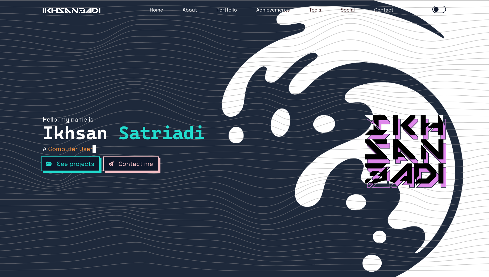

<h1 align="center">
  Ikhsan Satriadi
</h1>

<p align="center">
  <i>A portfolio</i>
</p>

<div align="center">
  <a href="https://ikhsan3adi.github.io">
    
  </a>
</div>

<br />

<div align="center">
  <a href="https://github.com/ikhsan3adi/ikhsan3adi.github.io/actions/workflows/ci.yml">
    
  </a>
  <a href="https://github.com/ikhsan3adi/ikhsan3adi.github.io/actions/workflows/gh-pages.yml">
    
  </a>
  <a href="https://github.com/ikhsan3adi/ikhsan3adi.github.io/actions/workflows/pages/pages-build-deployment">
    
  </a>
</div>

<div align="center">
  
  
  
  
  
</div>

<br />



<hr />

## Design

The site embraces $(Neo)Brutalist$ aesthetics — raw, unapologetic, and function-first. Key principles:

- **High contrast** — bold black-on-white backgrounds with stark typographic hierarchy for maximum readability.
- **Minimal ornamentation** — every element earns its place; no decorative fluff.
- **Typographic focus** — `Cascadia Mono` for headings (h1–h2) for a bold, monospaced statement; `Space Grotesk` for body text and subheadings; `Mechsuit` for the logo — clean, geometric, and assertive.
- **Deliberate spacing** — generous whitespace guides the eye and lets content breathe.
- **Consistent rhythm** — a fixed set of spacing and sizing tokens keeps the layout grounded.
- **Scroll-triggered reveals** — elements animate into view as you scroll, adding motion without clutter.
- **Dark mode** — full theme support that inverts the palette while preserving contrast ratios.

The result is a portfolio that feels honest, direct, and memorable — much like the work it showcases.

## Technologies

- **Runtime** — [Bun](https://bun.sh)
- **Framework** — [SvelteKit](https://kit.svelte.dev/) (static adapter, prerendered SPA)
- **Styling** — [Tailwind CSS](https://tailwindcss.com)
- **Icons** — [Iconify](https://iconify.design/) via `@iconify/svelte`, [FontAwesome](https://fontawesome.com/) via `svelte-fa`
- **Fonts** — `@fontsource/cascadia-mono` (headings), `@fontsource/space-grotesk` (body), `Mechsuit` (custom, navbar logo)
- **Languages** — TypeScript, JavaScript

## Development

```bash
bun install      # install dependencies
bun run dev      # start dev server
bun run build    # production build to build/
bun run check    # type-check with svelte-check
bun run lint     # lint & format check
bun run format   # auto-format with Prettier
```

## Contributing

Contributions, issues, and pull requests are welcome.

## Author

**Ikhsan Satriadi** — [@ikhsan3adi](https://github.com/ikhsan3adi)
